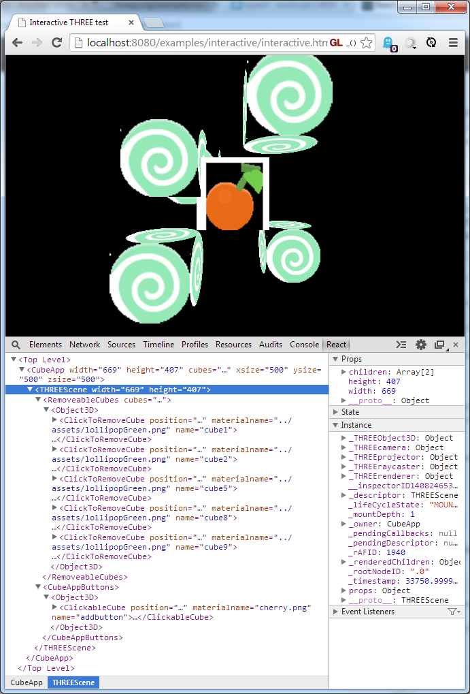

react-three
===========

Create/control a [three.js](http://threejs.org/) canvas using [React](https://github.com/facebook/react).

To use React for drawing 2D using WebGL, try [react-pixi](https://github.com/Izzimach/react-pixi).

react-three works with React 15
===============================

If you want to render 3D scenes with React 16 (fiber) there are some other options:

* [react-three-fiber](https://github.com/drcmda/react-three-fiber)
* [react-three-renderer](https://github.com/toxicFork/react-three-renderer).


Usage
=====

An example render function from the examples:


```js
render: function() {
  var MainCameraElement = React.createElement(
    ReactTHREE.PerspectiveCamera,
    {name:'maincamera', fov:'75', aspect:this.props.width/this.props.height,
     near:1, far:5000,
     position:new THREE.Vector3(0,0,600), lookat:new THREE.Vector3(0,0,0)});

  return React.createElement(
      ReactTHREE.Renderer,
      {width:this.props.width, height:this.props.height},
      React.createElement(
          ReactTHREE.Scene,
          {width:this.props.width, height:this.props.height, camera:'maincamera'},
          MainCameraElement,
          React.createElement(Cupcake, this.props.cupcakedata)
      )
  );
}
```

or if you want to use JSX,

```js
  render: function() {
    var aspectratio = this.props.width / this.props.height;
    var cameraprops = {fov : 75, aspect : aspectratio, 
                       near : 1, far : 5000, 
                       position : new THREE.Vector3(0,0,600), 
                       lookat : new THREE.Vector3(0,0,0)};

    return <Renderer width={this.props.width} height={this.props.height}>
        <Scene width={this.props.width} height={this.props.height} camera="maincamera">
            <PerspectiveCamera name="maincamera" {...cameraprops} />
            <Cupcake {...this.props.cupcakedata} />
        </Scene>
    </Renderer>;
  }
```

Install and Use with npm
========================

The current version of react-three is 0.9 which uses React 15.

If you are building a project with a `package.json` file you can

```
npm install react --save
npm install react-dom --save
npm install three --save
npm install react-three --save
```

and then access the extensions via a `require` expression:

```
var React = require('react');
var ReactTHREE = require('react-three');
var THREE = require('three');
```

Building Standalone Files
=========================

You can build two versions of the library:
* The default with global libraries (`React`,`THREE`, and `ReactTHREE`) exposed,
  for easy inclusion using a `<script>` tag.
* The `commonjs` version which is basically a commonjs module that you can `require` from.
  
Checkout the git repository. You will need node and npm.

```
git clone https://github.com/Izzimach/react-three.git
cd react-three
npm install
```

At this point, you can build and package the files. If you want a file you can just
include using a `<script>` tag make the default version:

```
npm run build
```

This will package up the react-three components along with React and put the result in
build/react-three.js. If you include this into your webpage via a script tag:

```
<script src="react-three.js"></script>
```

Then the relevant parts will be accessed in the global namespace as `React`, `ReactTHREE`, and `THREE`.

For the commonjs version you must invoke the `build-commonjs` task:

```
npm run build-commonjs
```

This produces the file es5/react-three-commonjs.js which can be used as a normal
commonjs library like the one published to npmjs.



Node Props
==========

In general, you specify props with names and content that are the same
as equivalent three.js nodes. For example, the three.js Mesh object has
a position, geometry, and material. You would render a Mesh component as:

```
React.createElement(ReactTHREE.Mesh, {position:p, geometry:g, material:m}
```

where `p`,`g`, and `m` are the same values you would have set in a three.js Mesh object:

* `p` is position, a `THREE.Vector3`
* `g` is geometry data such as `THREE.BoxGeometry`
* `m` is a material like a `THREE.MeshBasicMaterial`

Extra Props
-----------

The `THREERenderer` component has a few extra props that aren't in the standard `Renderer` object:

* `enableRapidRender`: if set to `true` will re-render the scene every frame even if nothing was modified by React. This is for handling non-static THREE entities such as animated meshes and particle systems.
* `background`: is the background color specified as a number, usually hex (for example `0x202020`). This basically maps to the clear color.
* `customRender` is a user-defined function that can be used to intercept and modify the render path. It takes arguments `(renderer, scene, camera)` for each scene. Normal behavior would be to call `renderer(scene, camera)` but you can do what you want. Be sure to handle the case of multiple scenes!


Also, the `THREEScene` component has a few extra props that aren't in the standard `Scene` object:

* `width`, `height` : these are passed into the renderer but also need to be passed in each scene in order to configure the camera.
* `camera`: specifies the name of the camera to use when rendering. The default is `maincamera`
* `orbitControls`: you can specify an orbit controller (typically `THREE.OrbitControls`) for the scene. Note that this consumes mouse input so will not work well with `pointerEvents`. The 'orbitcontrols' example shows how to use this prop.
* `pointerEvents`: an array of strings containing the names of events that will be processed and forwarded to objects in the scene. The code uses ray casting to find which object gets the event. For example `['onClick', 'onMouseMove']` will send mouse clicks and move events to whatever object is under the mouse. To handle events, add handler functions as props to your component with `3D` appended - so use the `onClick3D` prop to handle mouse clicks on your object. See the 'interactive' example for more details.


Examples
========

Examples are set up in the examples/ directory. You can run

```
npm run examples
```

Then open the example index in your browser at `http://localhost:8080/`

Testing
=======

The test runner requires Firefox to be installed. You can get Firefox from http://firefox.com.

Some tests require WebGL and cannot be run on the CI test server. Because of
this, it is recommended that you run the tests locally before submitting a pull request.

You can run two sets of tests via npm: `npm run test` runs some basic javascript
tests while `npm run rendertest` will check actual rendered output
on a WebGL canvas.

```
npm run test
npm run rendertest
```

The render tests compare their render output to known correct reference images.
If for some reason you need to generate (or regenerate) the pixel reference images,
you can! Install slimerjs and run the `pixelrefs` npm task

```
npm install -g slimerjs
npm run pixelrefs
```

